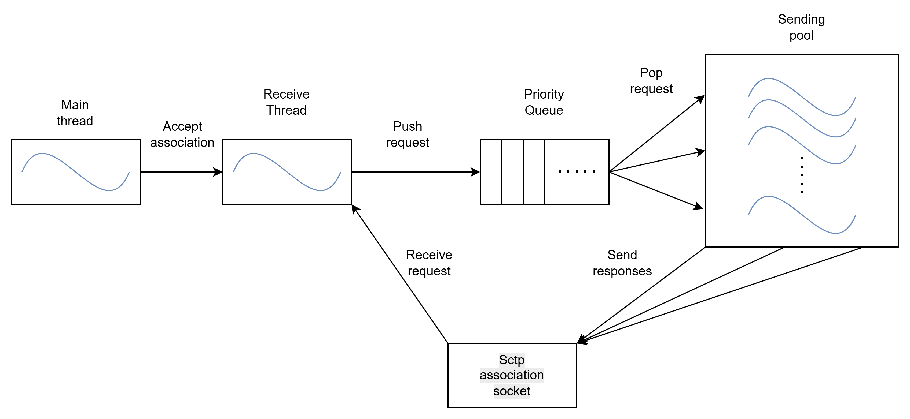
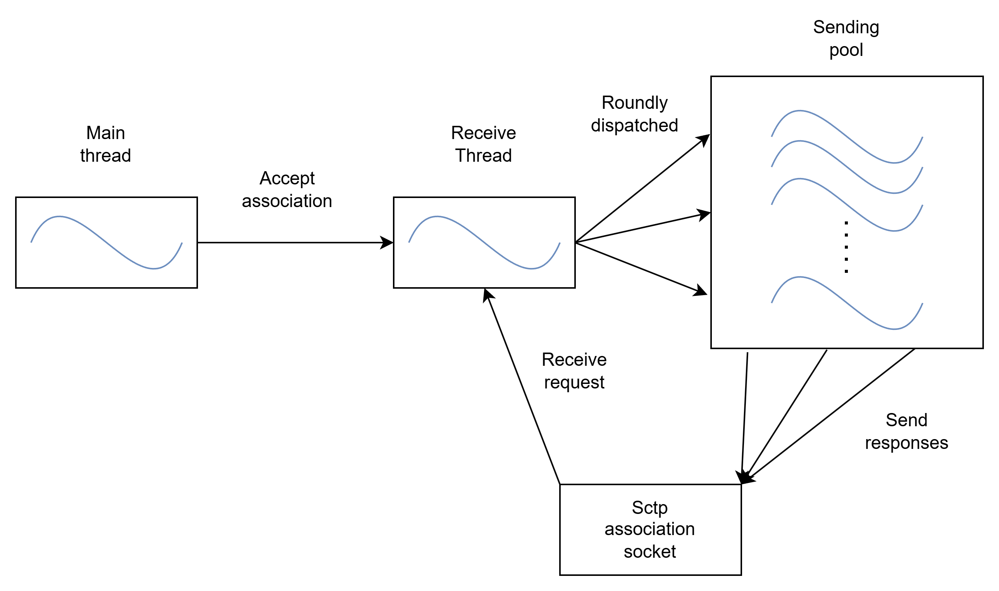
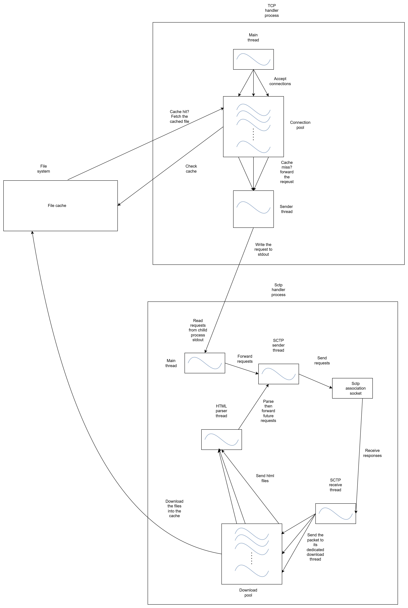

# Communication Flow Scheduling in a Web Server

This is the codebase of my Bachelor's thesis in Computer Science. The full thesis can be read [here](README_RESOURCES/Communication_Flow_Scheduling_in_a_Web_Server.pdf).

## Problem Description

Many web servers still run on **HTTP/1.1**, a simple client-server protocol where communication is managed over a single **TCP** connection.  
Modern web browsers open multiple such connections to multiplex data transfer. However, due to the protocol’s simplicity, problems such as **head-of-line (HOL)** blocking may occur.  
Moreover, this architecture does not take into account certain details (e.g. file size) that could be used to improve the delivery of static HTML content.

## Motivation

This thesis explores the possibility of designing a different architecture in which incoming HTML requests are served based on a server-side scheduling policy such as  
**Shortest Connection First (SCF)** or **Round Robin (RR)**, without requiring modifications to existing open-source browsers.

To make scheduling meaningful in this context, a **proxy** is introduced between standard HTTP/1.1 clients and the server.  
Furthermore, communication is handled using the [**Stream Control Transmission Protocol (SCTP)**](https://en.wikipedia.org/wiki/Stream_Control_Transmission_Protocol)  
at the transport layer. SCTP provides a reliable, message-oriented alternative to TCP, supporting multistreaming within a single **association**.

The addition of the proxy endpoint also enables further optimizations, such as caching mechanisms and prefetching of embedded data in static HTML content.

## System Architecture Preview

## Server SCF Design

## Server RR Design

### Proxy Design

## Implementation and Benchmarking Tests

The entire system was implemented in **Rust**. SCTP APIs were accessed in Rust using **Foreign Function Interface (FFI)** bindings to the  
[lksctp-tools](https://github.com/sctp/lksctp-tools) C library.

Performance tests were primarily conducted by comparing the SCTP-based system to its TCP counterpart. Network load was generated using scripts written in either **Python** or **Rust**.

More details about the implementation, benchmarking, and other aspects can be found [in the thesis](README_RESOURCES/Communication_Flow_Scheduling_in_a_Web_Server.pdf).
